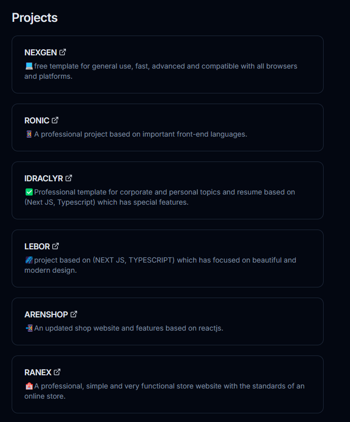
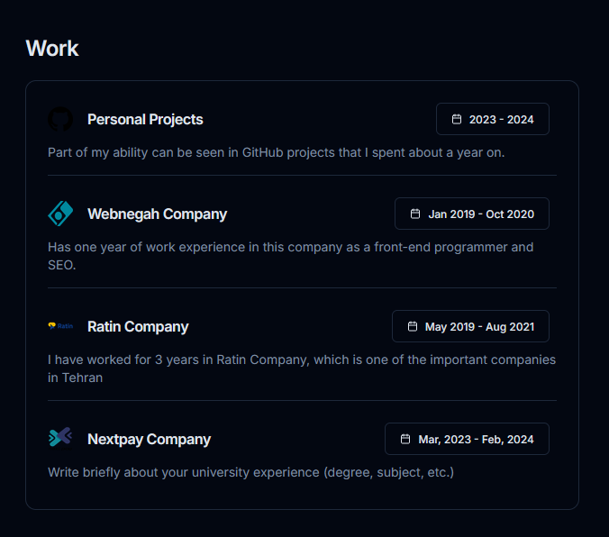

<h2>Draclyr-Portfolio Template</h2>
<p>🧑🏻Professional resume website based on nextjs, typescript which is very useful for showing abilities and work experience and required information.</p>

## Getting Started

Install the template packages via the code below:

```bash
npm install
```

And then run the project with the following code:

```bash
npm run dev
```

then Open [http://localhost:3000](http://localhost:3000) with your browser to see the result.
<br>

<p>🎈A professional menu that has all the facilities needed for a website:</p>

<br>
<p>🎆A separate, beautiful and professional section to display your projects:</p>

<br>
<p>👀In this section, you can enter your work history in addition to company information:</p>

<br>
<p>And finally, I will be very happy if you rate the project❤️</p>
